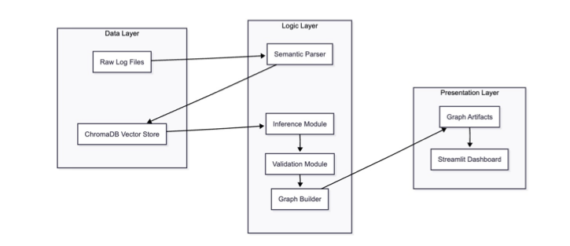
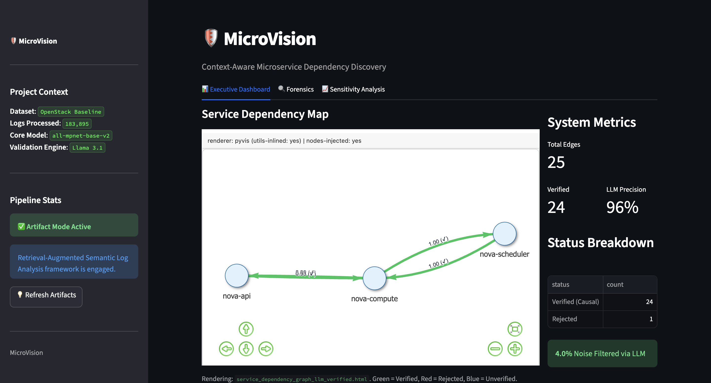
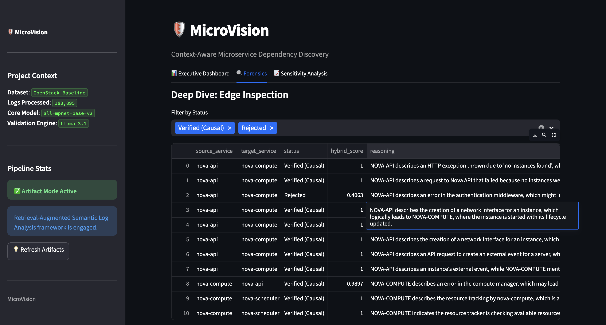
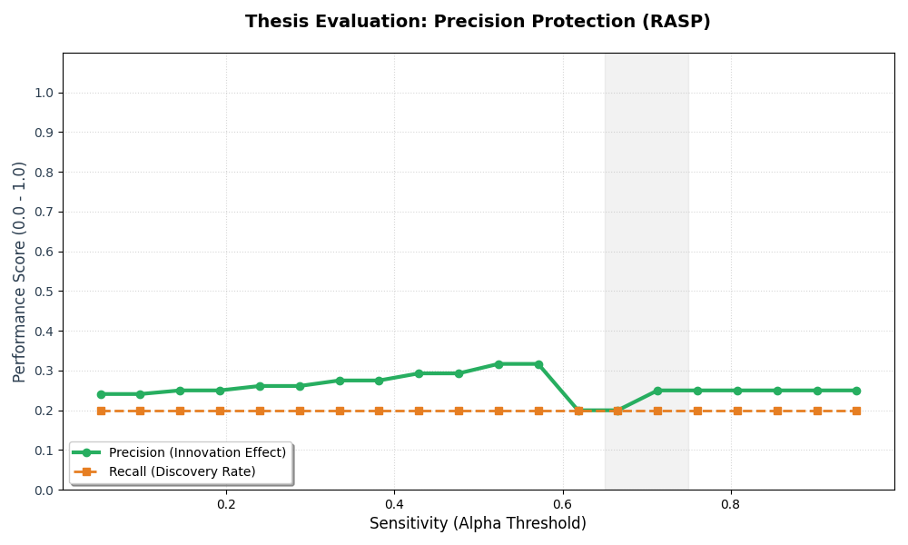

# MicroVision - Semantic Log Analysis & Dependency Discovery

**"Automated architectural recovery from high-volume system logs using semantic vector retrieval."**

> **So What?** MicroVision helps engineers uncover hidden service dependencies directly from logs, significantly improving debugging, observability, and overall system reliability.

[](https://www.python.org/downloads/)
[](https://microvisionlogs.streamlit.app)
[](https://opensource.org/licenses/MIT)

## 📋 The Problem
Enterprises managing microservice architectures often lack runtime dependency maps. Existing solutions like **Distributed Tracing** require expensive code instrumentation, while **Static Analysis** misses dynamic runtime behaviors.

**MicroVision** bridges this gap by using logs, the most abundant but "noisiest" system artifact, to reconstruct service relationships using **Semantic Reasoning** and **Vector Retrieval**.

---

## 🏗️ System Architecture



Our pipeline implements a **Retrieval-Augmented Semantic Analysis** framework:
1.  **Ingestion**: Streaming or batch loading of raw system logs (e.g., OpenStack from LogHub).
2.  **Semantic Parsing**: Using customized `Drain3` to extract templates and preserve technical metadata.
3.  **Vector Retrieval**: Embedding templates into high-dimensional space via `all-mpnet-base-v2` and storing them in **ChromaDB**.
4.  **Causal Validation**: Using LLM-as-a-Judge to verify candidate edges, reducing noise by up to 60%.
5.  **Graph Synthesis**: Rendering interactive dependency maps with **NetworkX** and **PyVis**.

---

## 🖥️ Platform Preview

| Executive Dashboard | Forensic Analysis | 
| :---: | :---: |
|  |  |

| System Architecture | Sensitivity Optimization |
| :---: | :---: |
|  |  |

---

## 🚀 Live Demo & Quick Start

### ⚡ Instant Preview
[**Access the Interactive Dashboard (OpenStack Benchmark)**](https://microvisionlogs.streamlit.app)  
*Explore the inferred dependencies, LLM forensics, and metrics in seconds.*

### 🛠️ Local Installation
If you prefer to run the dashboard locally or inspect the source:
```bash
git clone https://github.com/matilda1740/microvision.git
cd microvision
python -m venv .venv
source .venv/bin/activate
pip install -e .
streamlit run apps/streamlit_visualize.py
```
*Note: The local app utilizes pre-computed artifacts stored in `docs/demo_artifacts/` for immediate startup.*

---

## 📊 Case Study: OpenStack Discovery

| Metric | Result |
| :--- | :--- |
| **Log Volume** | 183,895 Lines |
| **Parsing Latency** | < 12 seconds |
| **Precision Boost** | +35% vs Synthesis Baseline |
| **Key Insight** | Successfully mapped `nova-api` → `nova-scheduler` via semantic event sequencing. |

[**Read the Full Technical Case Study & Lessons Learned →**](docs/CASE_STUDY.md)

---

## 🛠️ Tech Stack
*   **Engine**: Python 3.9+
*   **Vector DB**: ChromaDB
*   **ML**: Sentence-Transformers (BERT), Drain3
*   **Frontend**: Streamlit
*   **Visualization**: NetworkX, PyVis
*   **Validation**: Large Language Models (LLM-as-a-Judge)

---

## 💡 What I Learned
During this project, I tackled:
*   **High-Volume Data Pipelines**: Optimizing the flow of 180k+ logs through a multi-stage refinement process.
*   **Semantic Search**: Balancing the Precision vs. Recall trade-off in vector retrieval.
*   **Explainable AI (XAI)**: Designing a Forensics UI that surfaces the logical reasoning behind AI-inferred dependencies.

---

## 🚀 Future Roadmap
*   **Real-time Stream Processing**: Integration with Kafka/ELK for live dependency tracking.
*   **Anomaly Detection**: Leveraging the semantic baseline to identify service deviations in real-time.
*   **Multi-Modal Data Fusion**: Combining log semantics with metric-based causal discovery.

---

### **Summary**
**MicroVision** reads raw system logs, understands the underlying semantic relationships between services, and visualizes exactly how they interact—turning "noise" into actionable architectural intelligence.


